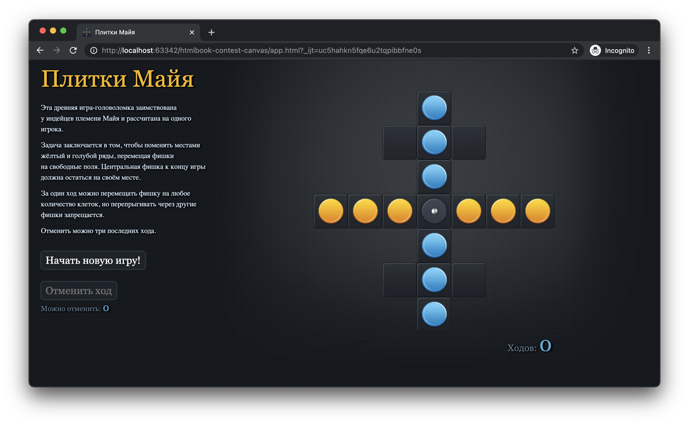

# htmlbook-contest-canvas 👾

Hello 👋 from 2011 and `canvas` 📋 support in all modern browsers (excluding IE 🤬).



It still works in Safari and Chrome.

Original `README` contents:

```text
 _______________________________
< В рот мне ноги, вот это игра! >
 -------------------------------
        \   ^__^
         \  (OO)\_______
            (__)\       )\/\
             U  ||----w |
                ||     ||

```
